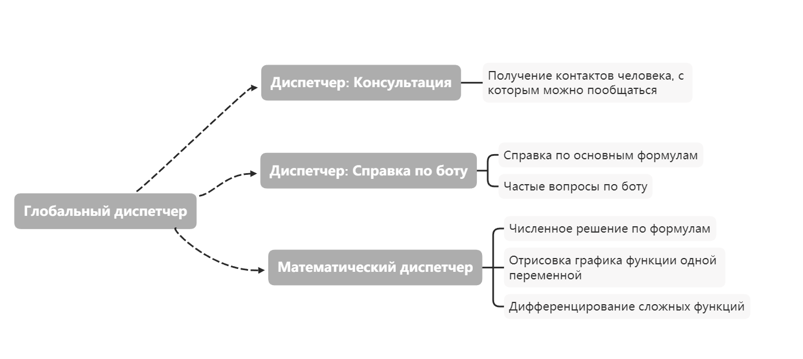

# TelegramMathBot 

## Участиники
Гильмутдинов Даниил  
Кузьмин Роман  
Аткишкин Владислав  
Фрицлер Виктор  

## Проблема, которую решает проект: 
Студент хочет решить математическую задачу, но вычисления слишком затратные. При этом у него установлен Telegram. Для этого он заходит в переписку с нашим ботом, выбирает режим работы(вычисления примеров, решение интегралов, построение графиков и тд.) и вбивает свой пример.

## Описание основных компонент системы
- Telegram Бот     
*Слой представления: предоставляет пользователю интерфейс взаимодействия.*      
Взаимодествие с пользователем:  
Принимает запросы клиента в виде сообщений и передает их на обработку диспетчеру, затем получает результат от него и отправляет его клиенту.  
  
- Глобальный диспетчер      
*Слой доменной логики: хранит список диспетчеров и метод для взаимодействия с ними.*           
Определяет тип задачи (Математическая задача, Консультация, Справка по боту) и вызывает определенный диспетчер
- Конкретный диспетчер     
*Слой доменной логики*    
Определяет какая задача была выбрана пользователем.  
Возвращает результат в виде команды-запроса для Telegram - бота (например /sendPhoto..., /sendMessage)
- Парсер  
Получает данные в текстовом формате, парсит, и возвращает результат в нужном формате.  
Реализуем интерфейс IParser<Tin, Tout> с методом GetData  
- Класс-решатель  
*Слой доменной логики*       
Получает данные, решает задачу и возвращает результат.  
Реализуем интерфейс ITask<Tin, Tout> с методом GetResult    

Поскольку парсер и соответствующий ему решатель связаны, их можно объединить в класс - ClientTask с методом GetResult, который принимает запрос клиента в виде строки. Для каждого таска необходим метод, который бы представлял данные в заданном формате, например для запроса в Telegram'е (GetResultForTelegram). Для этого мы используем паттерн Visitor. (можно представлять не только для телеграм бота)

## Точки расширения
1) Типы расширяемых задач
- Численное решение по формулам (размещения, факториал, сочетания и тд.)
- Отрисовка графика функции одной переменной
- Дифференцирование сложных функций
- Можно добавить класс - решатель для каждой новой задачи
- Для каждой задачи необходим свой парсер, с расширением задач расширяется парсер
- Для каждой задачи добавляется новый интерфейс взаимодействия - сценарий пользователя (например, разные кнопки, последовательность требуемых действий от пользователя для каждого типа задач)

2) Многофункциональность бота
- Возможность добавить консультацию в чате (доп. функция)
- Решение задач математических
- Bug report

3) Генерация картинок для графиков функицй в разном формате
- PNG
- JPG
- SVG
